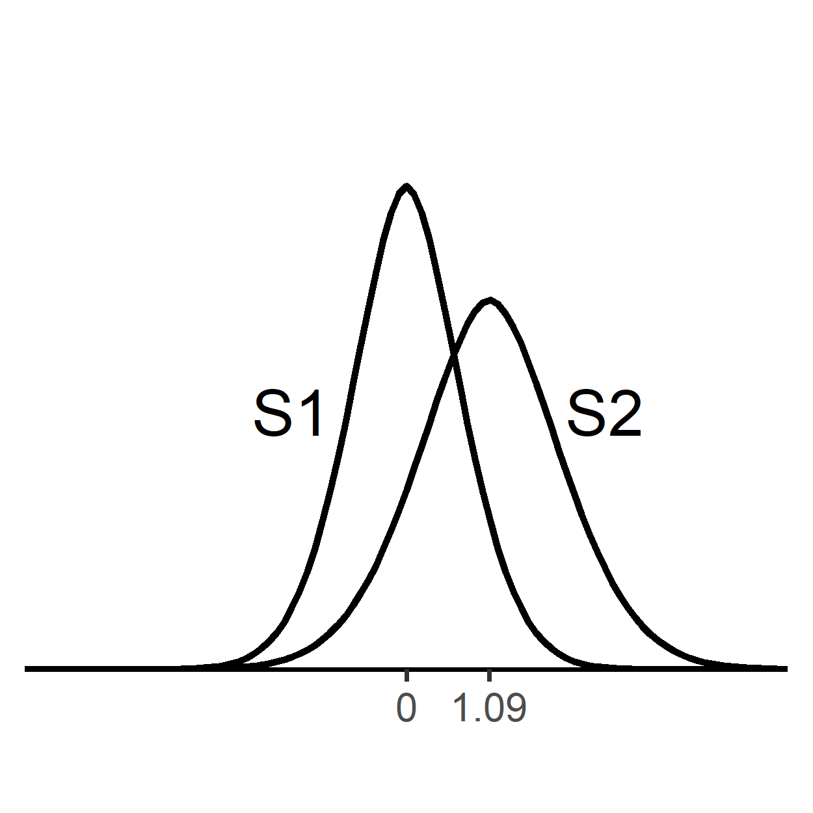
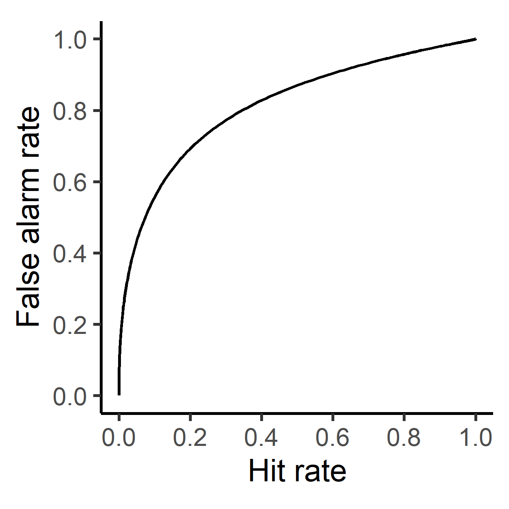
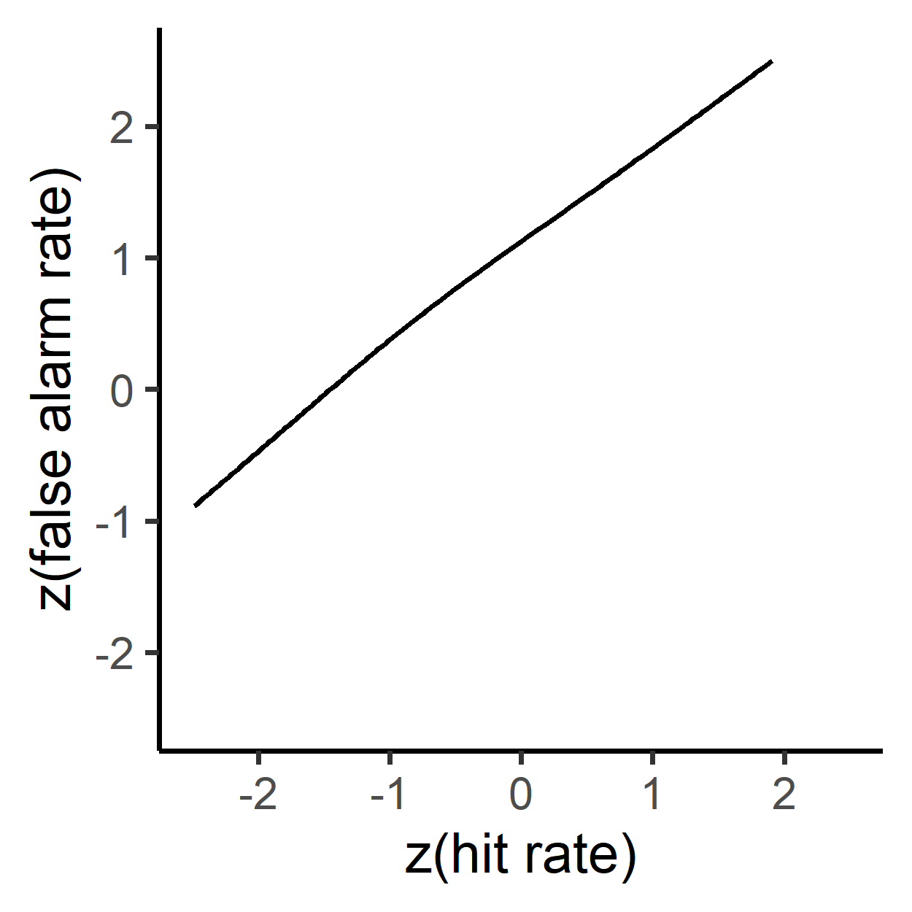

<!-- README.md is generated from README.Rmd. Please edit that file -->

# ggsdt

<!-- badges: start -->

[](https://github.com/kiyomiyoshi/ggsdt/actions)
<!-- badges: end -->

The `ggsdt` package implements generalized gaussian signal detection
theory analysis
(<https://www.biorxiv.org/content/10.1101/2022.10.28.514329v1>).

## Installation

You can install the development version of `ggsdt` from
[GitHub](https://github.com/) with:

``` r
# install.packages("devtools")
devtools::install_github("kiyomiyoshi/ggsdt")
```

## Functions

`fit_ggsdt()`: implements model fitting  
`ggdistr()`: plots internal distributions  
`ggroc1()`: plots type1 ROC  
`ggzroc1()`: plots z-transformed type1 ROC

Consult each function’s document for more information:
e.g. `help(fit_ggsdt)`

## Example

The `fit_ggsdt()` function requires arguments as specified in Maniscalco
& Law’s webpage: <http://www.columbia.edu/~bsm2105/type2sdt/>  
The same arguments are also employed in `metaSDT` package:
<https://github.com/craddm/metaSDT>

`nR_S1` and `nR_S2` are response frequency vectors, ordered from highest
confidence S1 to highest confidence S2.  
`add_constant = TRUE` adds a small value to the response frequency
vectors primarily for avoiding zero-cell-related issues (default value
is TRUE). See above pages for more information.

``` r
library(ggsdt)

nR_S1 <- c(170, 120, 50, 25, 45, 40)
nR_S2 <- c(40, 50, 30, 20, 70, 240)

f1 <- fit_ggsdt(nR_S1, nR_S2, add_constant = F)
f1
#>        mu2   alpha2     beta   LogLike    sigma1    sigma2  kurtosis         X1
#> 1 1.090098 1.306408 1.782542 -1338.253 0.7556205 0.9871485 0.2562262 -0.2240238
#>          X2        X3        X4       X5
#> 1 0.2713651 0.5001792 0.6354313 1.011963
```

``` r
ggdistr(f1[1, 1], f1[1, 2], f1[1, 3])
```



``` r
ggroc1(f1[1, 1], f1[1, 2], f1[1, 3])
```



``` r
ggzroc1(f1[1, 1], f1[1, 2], f1[1, 3])
```


